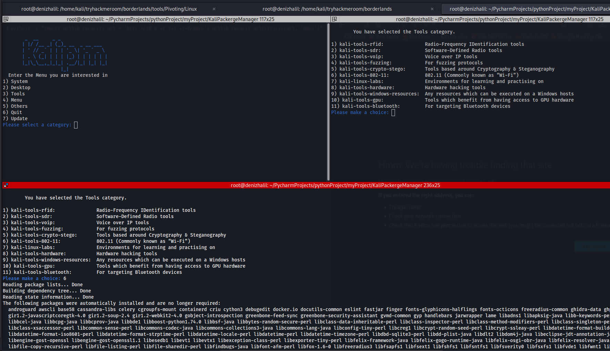

# KaliPackergeManager
kalipm.sh is a powerful package management tool for Kali Linux that provides a user-friendly menu-based interface to simplify the installation of various packages and tools. It streamlines the process of managing software and enables users to effortlessly install packages from different categories.



## Features

- Interactive Menu: Enjoy an intuitive and user-friendly menu-based interface for easy package selection.
- Categorized Packages: Browse packages across multiple categories, including System, Desktop, Tools, Menu, and Others.
- Efficient Installation: Automatically install selected packages with the help of the `apt-get` package manager.
- System Updates: Keep your system up to date with the integrated update functionality.

## Installation

To install KaliPm, you can simply clone the repository from GitHub:
```
git clone https://github.com/HalilDeniz/KaliPackergeManager.git
```

## Usage

1. Clone the repository or download the KaliPM.sh script.
2. Navigate to the directory where the script is located.
3. Make the script executable by running the following command:
   ```
   chmod +x kalipm.sh
   ```
4. Execute the script using the following command:
   ```
   ./kalipm.sh
   ```
5. Follow the on-screen instructions to select a category and choose the desired packages for installation.

## Categories

- **System**: Includes essential core items that are always included in the Kali Linux system.
- **Desktop**: Offers various desktop environments and window managers to customize your Kali Linux experience.
- **Tools**: Provides a wide range of specialized tools for tasks such as hardware hacking, cryptography, wireless protocols, and more.
- **Menu**: Consists of packages tailored for information gathering, vulnerability assessments, web application attacks, and other specific purposes.
- **Others**: Contains additional packages and resources that don't fall into the above categories.

## Update

KaliPM.sh also includes an update feature to ensure your system is up to date. Simply select the "Update" option from the menu, and the script will run the necessary commands to clean, update, upgrade, and perform a full-upgrade on your system.

## Contributing
Contributions are welcome! To contribute to KaliPackergeManager, follow these steps:

1. Fork the repository.
2. Create a new branch for your feature or bug fix.
3. Make your changes and commit them.
4. Push your changes to your forked repository.
5. Open a pull request in the main repository.


## Contact

If you have any questions, comments, or suggestions about Tool Name, please feel free to contact me:

- LinkedIn: https://www.linkedin.com/in/halil-ibrahim-deniz/
- TryHackMe: https://tryhackme.com/p/halilovic
- Instagram: https://www.instagram.com/deniz.halil333/
- YouTube: https://www.youtube.com/c/HalilDeniz
- Email: halildeniz313@gmail.com

## License

Tool Name is released under the MIT License. See LICENSE for more information.

## 💰 You can help me by Donating
Thank you for considering supporting me! Your support enables me to dedicate more time and effort to creating useful tools like DNSWatch and developing new projects. By contributing, you're not only helping me improve existing tools but also inspiring new ideas and innovations. Your support plays a vital role in the growth of this project and future endeavors. Together, let's continue building and learning. Thank you!"<br>
[](https://buymeacoffee.com/halildeniz) 
[](https://patreon.com/denizhalil) 

